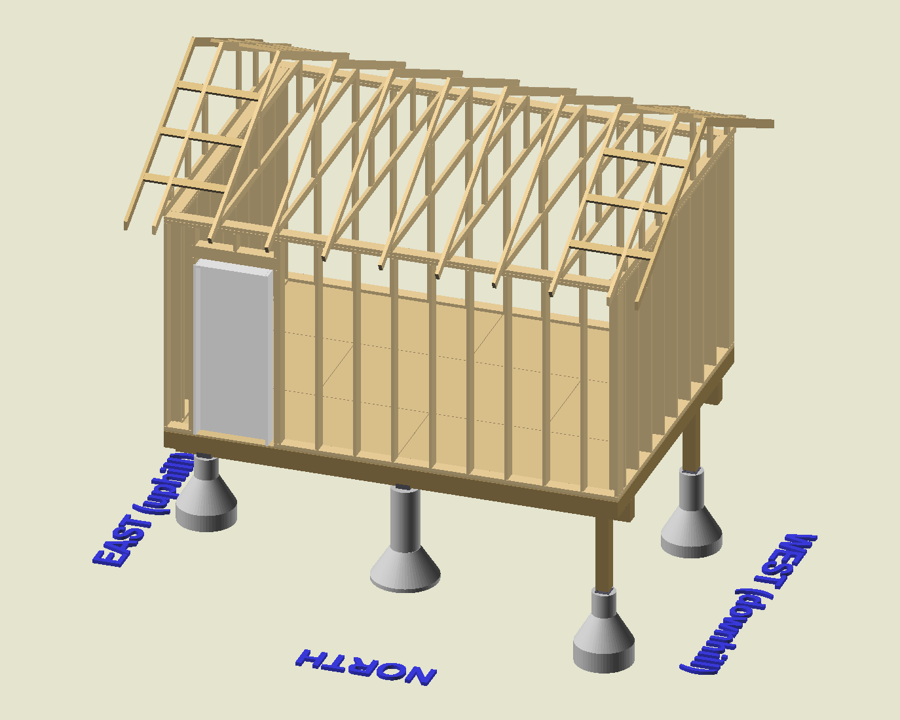
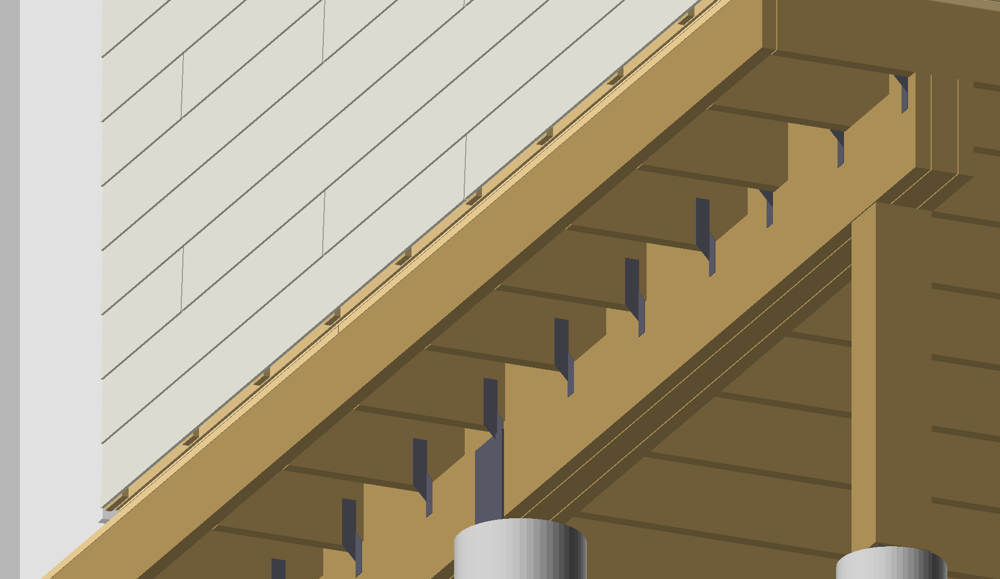

# My AI Shed

## A 12x16 Shed, primarily designed by Claude

I'm building a shed and this repository documents the design.

## Table of Contents

- [0 — Shed Design](0-readme.md)
- [1 — Pier Design & As-Built Details](1-piers.md)
- [2 — Beam](2-beam.md)
- [3 — Floor Joists](3-joists.md)
- [4 — Wall Framing](4-walls.md)
- [5 — Wall Assembly Layers](5-wall-layers.md)
- [6 — Trusses (Queen-Post Design)](6-trusses.md)
- [7 — Roof](7-roof.md)
- [8 — Fastener Schedule](8-fasteners.md)

## Screenshots of the Model

